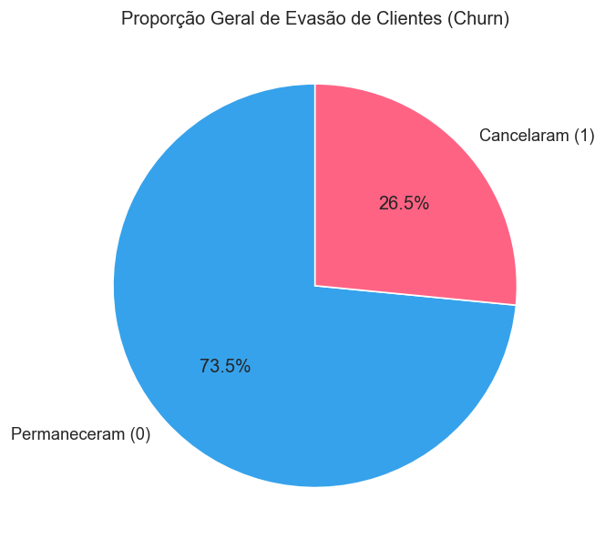
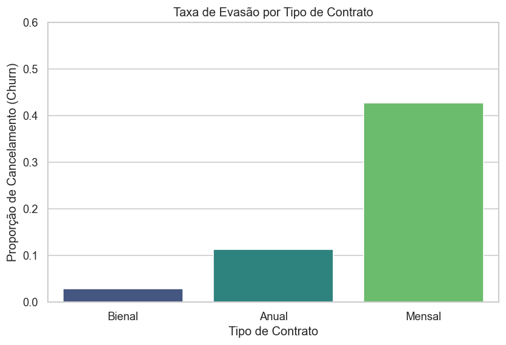
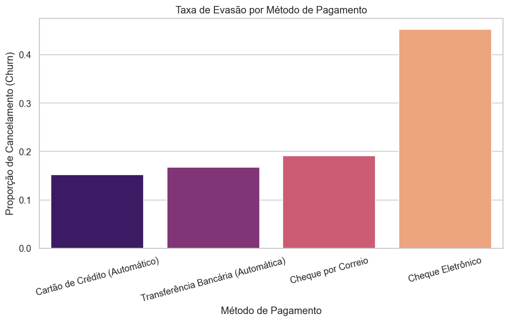
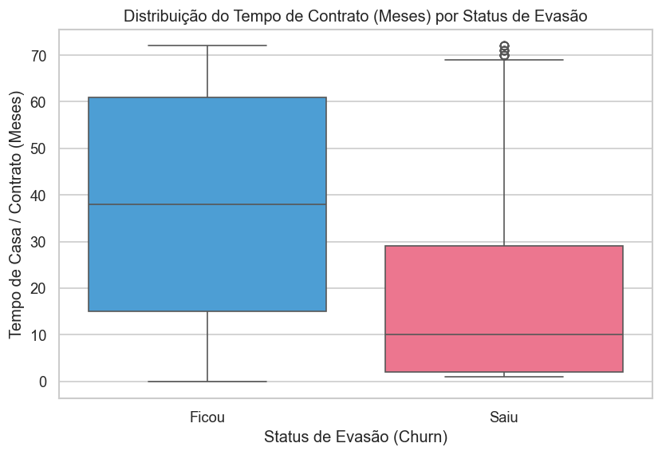

# Relatório Executivo: Análise de Evasão de Clientes (Churn) — TelecomX

Olá! Este projeto foi desenvolvido por mim como aluna do **Oracle Next Education (ONE)**, um programa de formação focado em tecnologia promovido pela **Oracle** em parceria com a **Alura**. 

Este é o meu **2º Challenge** oficial dentro do programa, onde recebi o desafio de atuar como Cientista de Dados para solucionar um problema real de negócios. O relatório abaixo apresenta os principais insights e resultados extraídos da base de dados da operadora **TelecomX** (7.043 clientes analisados), com o objetivo de identificar os gargalos que causam o cancelamento de serviços e propor caminhos estratégicos baseados em dados para reter esses usuários.

---

## Diagnóstico Geral da Operadora

Ao analisarmos o panorama completo da empresa, identificamos que a taxa de evasão (*churn*) é de **26,5%**. Isso significa que mais de um quarto da base de clientes cancelou seus serviços no período avaliado, representando um risco crítico para a receita.

---

## Principais Fatores que Impulsionam o Churn

### 1. Fragilidade nos Contratos de Curto Prazo (Mensais)
O tipo de contrato é o fator mais decisivo para a perda de clientes. Usuários que utilizam o modelo de contratação **Mensal** possuem uma taxa de cancelamento alarmante em comparação com os modelos de longo prazo (Anual e Bienal).

> **Validação Estatística:** Aplicamos o **Teste Qui-Quadrado de Independência** para comprovar se esse comportamento era um padrão real ou apenas coincidência. O teste retornou um **p-valor de 0.000000** (estatisticamente significante), provando matematicamente que o modelo de contrato mensal é o maior causador de instabilidade na base.

### 2. Atrito no Método de Pagamento (Cheque Eletrônico)
Identificamos um comportamento crítico cruzando as formas de pagamento: clientes que pagam via **Cheque Eletrônico** cancelam significativamente mais do que aqueles que utilizam métodos automáticos (Cartão de Crédito ou Transferência Bancária). 

* **Insight de Negócio:** O processo manual e recorrente do cheque eletrônico cria um "momento de fricção", onde o cliente é forçado a pensar todo mês se vale a pena continuar pagando pelo serviço.

### 3. O Perigo dos Primeiros Meses (Tempo de Casa)
O comportamento de cancelamento está fortemente concentrado no início do ciclo de vida do cliente. O gráfico abaixo mostra que os usuários que saíram (*Churn = Saiu*) tinham pouquíssimos meses de contrato com a empresa.

* **Insight de Negócio:** Se o cliente ultrapassar a barreira crítica dos primeiros meses (período de onboarding e adaptação), a chance de ele permanecer fiel e se tornar um cliente de longo prazo aumenta drasticamente.

---

## Recomendações Estratégicas para o Time de Negócios

Com base nas evidências visuais e estatísticas deste relatório, as ações recomendadas são:

1. **Incentivo à Migração de Contrato:** Criar campanhas de marketing oferecendo descontos ou vantagens para clientes "Mensais" migrarem para os planos "Anuais".
2. **Automação de Pagamentos:** Desenvolver incentivos financeiros (como um pequeno bônus na primeira fatura) para que clientes que usam "Cheque Eletrônico" cadastrem o "Cartão de Crédito Automático".
3. **Foco no Onboarding:** Implementar uma régua de relacionamento mais agressiva e um suporte prioritário para os clientes nos seus primeiros 6 meses de casa, onde o risco de evasão é máximo.

---

## Notas Técnicas do Projeto
* **Linguagem:** Python 3 (Pipeline automatizado executável via Jupyter Notebook).
* **Bibliotecas de Análise:** Pandas e NumPy para tratamento e modelagem dos dados.
* **Bibliotecas Visuais:** Matplotlib e Seaborn para geração dos relatórios gráficos em português.
* **Módulo Estatístico:** SciPy (`chi2_contingency`) para validação científica das hipóteses de negócio.

## ✨ Autora

**Leticia Heeren**
Estudante de tecnologia | Formação Oracle Next Education (ONE) + Alura

---

*Projeto desenvolvido para fins educacionais como parte do programa Oracle Next Education.*
